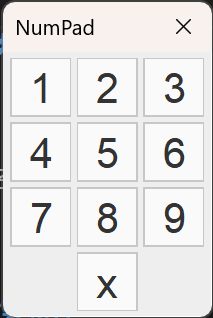

# 数独程序

## c++ 部分

### 程序介绍

该数独程序的 c++ 主体由 Java 翻译而来. 我先写了 Java 实现, 在发现要用 c++ 实现之后直接把 `Map.java` 复制粘贴形成 `map.cpp`, 解决了所有报错, 成为主逻辑, 这样将计算逻辑与控制逻辑分块, 同样便于制作dll文件. 为了实现命令行输入输出, 编写了 `main.cpp` 主要控制交互逻辑. 为解决效率问题, 查找学习了舞蹈链算法, 编写了 `dancingLinksAlgorithm.cpp` 算法逻辑.

### 程序结构

工程主要分为 `main.cpp`, `map.cpp` 和 `dancingLinksAlgorithm.cpp` 三个文件. `main.cpp` 包含JNI接口实现, `map.cpp` 包含生成逻辑和求解入口, `dancingLinksAlgorithm.cpp` 包含求解逻辑.

### 主要功能

#### 数独求解模块

对给定的数独判断是否合法, 如果是, 使用舞蹈链进行求解.

| 函数名                                         | 功能                                     |
| :--------------------------------------------- | :--------------------------------------- |
| `solve`                                        | 入口点                                   |
| `initDancingLinksAlgorithm`                    | 初始化舞蹈链逻辑                         |
| `appendDancingLinksLineByIndex`                | 通过四个int增加矩阵的一行                |
| `completeDancingLinksInsertionOfMustSelectRow` | 基于给出元素必定选中的原则简化舞蹈链计算 |
| `runDancingLinksAlgorithm`                     | 主递归                                   |
| `removeCol`                                    | 舞蹈链算法核心: 移除列                   |
| `resumeCol`                                    | 舞蹈链算法核心: 恢复列                   |
| `checkCorrect`                                 | 检查数独是否正确                         |

#### 数独生成模块

参考 [基于“挖洞”思想的数独游戏生成算法](https://kns.cnki.net/kcms/detail/detail.aspx?dbcode=CJFD&dbname=CJFD2009&filename=SSJS200921000) 编写了数独生成模块. 步骤为:

| 函数名                 | 功能                                                                    |
| :--------------------- | :---------------------------------------------------------------------- |
| `generate`             | 入口点                                                                  |
| `generateFullMap`      | 首先生成第一行和第一列, 然后通过求解第一个有效数独生成解                |
| `generateLevelMap`     | 根据关卡数生成数独的入口点. 保证解的唯一性                              |
| `generateLowLevelMap`  | 1-10关, 以完全随机的策略挖洞                                            |
| `generateHighLevelMap` | 11-20关, 基于当空白较为集中时数独更难的原理, 以若干个起点向四周广搜挖洞 |
| `generateShuffledMap`  | 基于数独半独立性原理, 随机交换行列使得看上去更随机                      |

其余函数重要性较弱, 功能不在此赘述.

### 求解算法

采用舞蹈链算法求解, 首先将数独转化为精确覆盖问题, 然后利用舞蹈链求解.

### 生成算法

人解数独的难度主要由空格的数量和空格的聚集度控制. 故1-10关选用随机的挖洞策略, 空格依次增多; 11-20关采用聚集的挖洞策略, 空格依次增多. 10-11关由于更换了生成策略, 空格数减少以控制难度. 在第19, 20关, 挖去的数的数量基本达到了控制数独有唯一解的极限, 难度极大.

## Java部分

### 界面设计

界面风格为黑白色, 高端大气符合现代审美. 支持对错误位点标红, 对填入的数标蓝, 对提示的数标绿, 对不确定的位置以九宫格形式标记可能解. 左侧用一个 `JPanel` 在上面直接绘图; 右侧为一个 `VBox` 里面包含若干个控件. 所有的控件位置都是 Java 自动调整的. 还加入了一个小 Icon.

Numpad 主体是一个 4x3 的 `JPanel`, 通过循环添加9个数字键, 两个空白 `JPanel` 占位, 一个 `x` 用于清除格子的内容.

### 类设计

Java 部分的类结构如下:

|         类名          | 功能                                                                                 |
| :-------------------: | :----------------------------------------------------------------------------------- |
|        `Main`         | 入口点, 实例化并配置 `MainPanel`.                                                    |
|      `MainPanel`      | 主GUI类, 处理大部分事件.                                                             |
|      `MapPanel`       | 左侧的数独 GUI 类, 重写 `JPanel.paint(Graphics g)` 方法绘图, 同时处理与它有关的事件. |
|       `NumPad`        | Numpad GUI 类, 实例化 Numpad 并处理交互.                                             |
|    `ColoredButton`    | 辅助类, 新建一个不那么丑的 `JButton`                                                 |
| `ColoredToggleButton` | 辅助类, 新建一个不那么丑的 `JToggleButton`                                           |
|   `ColoredButtonUI`   | 用于前两者的 UI 类                                                                   |
|         `Map`         | 生成求解主逻辑, 通过 JNI 与 c++ 部分交互并用本地逻辑确定数独的状态.                  |
|       `Colors`        | 定义颜色                                                                             |
|      `NodeType`       | 定义每一个单元格的状态 (Flags)                                                       |

### 事件处理

基本使用匿名类或匿名函数实现系统事件和自定义事件的处理. 这更符合 C# 的 delegate 逻辑.

## 主要特性

### 全英文的代码

为防止出现字符集导致的乱码, 代码内全部使用英文.

### 良好的码风

重要变量和函数名尽量使用能一眼看明白作用的命名, 尽量避免滥用单字符变量, 规范的大括号, 做到代码易读易懂.

### STL 的使用

使用了一小点 STL 来减少从 Java 翻译到 c++ 的工程量.

### 唯一解

确保生成的数独具有唯一解.

### 更多功能

界面支持求解, 支持在 Level 标签上滑动滚轮选关, 支持时间每秒跳动......

## 性能说明

性能在求解较难数独时好于A和B.

| 示例  | 本程序 |    A     |    B    |
| :---: | :----: | :------: | :-----: |
|   1   |  97us  | 161327us | 76255us |
|   2   |  83us  | 398560us | 45634us |
|   3   |  74us  | 653845us | 4656us  |
|   4   |  87us  |  > 10s   | 3032us  |
|   5   |  55us  |  (无解)  | (无解)  |
